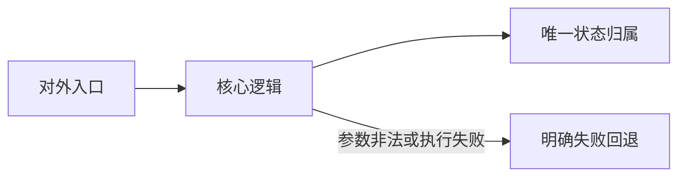

# {{业务域名称}}

## 域职责与端到端运行流转

说明进入本域的请求如何流转、内部状态归属谁、以及出错时如何安全退出：

```mermaid
flowchart LR
  API["对外入口"] --> Service["核心逻辑"]
  Service --> Store["唯一状态归属"]
  Service -->|参数非法或执行失败| Error["明确失败回退"]
```

## 清晰接口与禁止耦合

- **公开入口**：{{允许外部调用的函数、命令或接口}}
- **禁止耦合**：{{明确禁止跨层引用或直接改写哪类内部状态}}
- **硬约束与不变量**：{{数据范围、幂等键、权限或兼容边界}}
