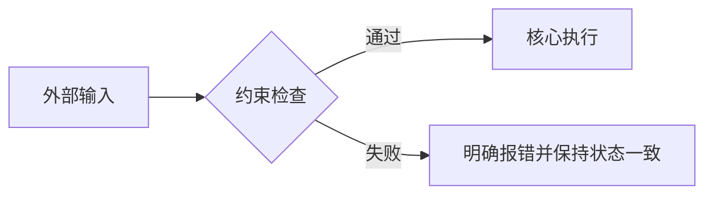

# {{模块名称}}

## 对外入口与职责范围

说明外部允许调用的公开接口是什么，以及哪些内部细节不得直接暴露。

## 状态归属、硬约束与异常处理

说明本模块唯一维护什么状态、写入前必须满足哪些约束，以及遇到非法输入或外部失败时如何安全退出。

## 运行与状态流转（涉及多步流转时用 `mermaid`）

```mermaid
flowchart LR
  Input["外部输入"] --> Check{"约束检查"}
  Check -->|通过| Action["核心执行"]
  Check -->|失败| Reject["明确报错并保持状态一致"]
```
